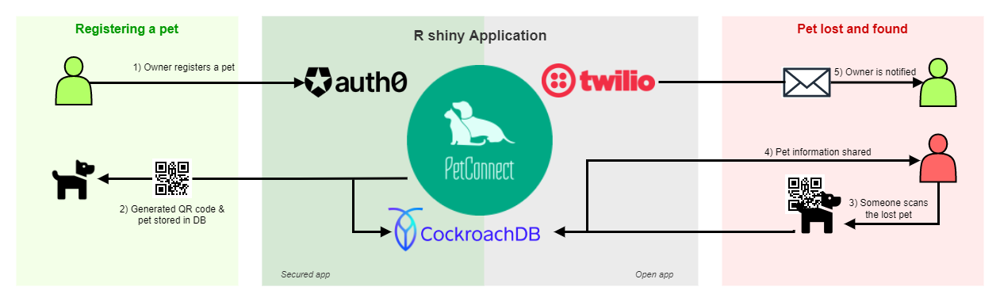

# PetConnect
_A project to help finding back your pet, made for the [Hacky Winterland hackathon](https://hackywinterland.devpost.com/) on December 24-26, 2021._

## Inspiration
A few weeks ago my parents found a lost dog in front of their house. It didn't have any tags, so the only way to find out who the owners were, was to take it to the vet and get the chip scanned. Luckily, the owners already sent out a search team in the neighborhood and my parents ran into them before they even reached the vet. It was a happy end! But of course it was a very stressful time for the dog owners. I have a dog as well and my parents have two and this inspired me to make it easier to make reconnecting with your lost pet easier. For me the classic address hangers with a paper always break after a short time and the engraved ones don't fit all the information I want on it. This is why I decided to create "PetConnect" during this Christmas hack.

## What it does
It is a very simple system. On https://emelieh21.shinyapps.io/pet-connect you can sign up and register your pet(s) with a picture, its name and the info that you would like to share. Once registered, the app creates a QR code for you. You can print this code out and stick on any tag you can attach to the collar of your pet. Once someone scans the QR code of your pet, it will show that person the information you shared about your pet. It will also inform you via email and SMS (if you choose to get notifications) about that fact that someone scanned your pet's code. This way you already know someone found it.

## How we built it
The app is built with R shiny and runs on shinyapps.io. Auth0 is used for the authentication of the user, Twilio is used for the SMS service and CockroachDB is used to store the apps data. For all details, see the diagram below:

## Challenges we ran into
Combining working on this hackathon with celebrating Christmas with the family is quite a challenge :)

## Accomplishments that we're proud of
That a minimal functioning product is up and running.

## What we learned
How easy it is to use Auth0, twilio and CockroachDB! I wasn't familiar with these services before, but will definitely use them again now I know how easy it is to integrate them in a Shiny app.

## What's next for PetConnect
I would like to keep working on it and make it possible to share more information with the pet owner after scanning the code immediately, for example location. I also want to make it easier to print the QR codes in the correct size. Maybe allow the creation on short links, to generate simpler codes. I would also like to make it possible to allow editing for the pets that are registered already, currently it is only possible to delete them.